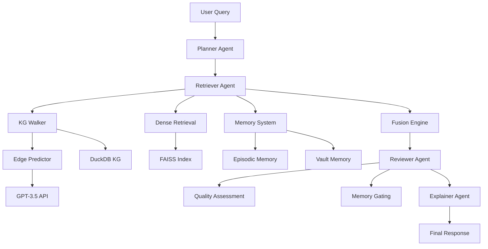

# HelixRAGxMem: System Architecture & Design

**Document Version**: 1.0  
**Last Updated**: January 5, 2025  

---

## 1. System Architecture Overview

### 1.1 High-Level Architecture

```
┌─────────────────────────────────────────────────────────────────┐
│                    HelixRAGxMem System                          │
├─────────────────────────────────────────────────────────────────┤
│  User Interface Layer                                           │
│  ├── Query Interface                                            │
│  └── Explanation Dashboard                                      │
├─────────────────────────────────────────────────────────────────┤
│  Multi-Agent Orchestration Layer                               │
│  ├── Planner Agent        ├── Retriever Agent                  │
│  ├── Reviewer Agent       └── Explainer Agent                  │
├─────────────────────────────────────────────────────────────────┤
│  Hybrid Retrieval Engine                                       │
│  ├── Knowledge Graph Walker  ├── Dense Retrieval Engine        │
│  ├── Edge Predictor         └── Fusion Engine                  │
├─────────────────────────────────────────────────────────────────┤
│  Memory Management System                                      │
│  ├── Episodic Memory        ├── Vault Memory                   │
│  ├── Memory Router          └── Quality Assessor               │
├─────────────────────────────────────────────────────────────────┤
│  Data Storage Layer                                            │
│  ├── Knowledge Graph (DuckDB)  ├── Dense Index (FAISS)         │
│  ├── Episodic DB (SQLite)      └── Vault DB (DuckDB)           │
├─────────────────────────────────────────────────────────────────┤
│  External Services                                             │
│  ├── OpenAI API            ├── BGE Embeddings                  │
│  └── Observability (Jaeger)                                    │
├─────────────────────────────────────────────────────────────────┤
│  Infrastructure Layer                                          │
│  ├── MCP Server (FastAPI)  ├── Container Runtime              │
│  └── Monitoring & Logging                                      │
└─────────────────────────────────────────────────────────────────┘
```

### 1.2 Component Interaction Flow



## 2. Component Specifications

### 2.1 Multi-Agent Orchestration Layer

#### 2.1.1 Planner Agent
**Purpose**: Query analysis and retrieval strategy planning

**Responsibilities**:
- Biomedical entity extraction and normalization
- Query complexity classification
- Computational budget allocation
- Retrieval strategy selection

**Interface**:
```python
class PlannerAgent:
    async def plan_retrieval(self, query: str) -> RetrievalPlan:
        """
        Analyze query and create retrieval plan
        
        Args:
            query: User's biomedical query
            
        Returns:
            RetrievalPlan with seeds, budget, and strategy
        """
        pass
    
    async def extract_entities(self, query: str) -> List[str]:
        """Extract biomedical entities from query"""
        pass
    
    async def classify_complexity(self, query: str) -> QueryComplexity:
        """Classify query complexity (factual/reasoning/synthesis)"""
        pass
```

**Dependencies**:
- Biomedical NER model
- Query complexity classifier
- Entity normalization service

#### 2.1.2 Retriever Agent
**Purpose**: Execute hybrid retrieval strategy

**Responsibilities**:
- Coordinate KG and dense retrieval
- Execute retrieval plan from Planner
- Fuse results from multiple sources
- Rank and filter retrieved evidence

**Interface**:
```python
class RetrieverAgent:
    async def execute_retrieval(self, plan: RetrievalPlan) -> RetrievalResults:
        """
        Execute hybrid retrieval based on plan
        
        Args:
            plan: Retrieval plan from Planner
            
        Returns:
            Fused results from KG and dense retrieval
        """
        pass
    
    async def retrieve_from_kg(self, seeds: List[str], budget: Budget) -> KGResults:
        """Retrieve from knowledge graph"""
        pass
    
    async def retrieve_from_dense(self, query: str, budget: Budget) -> DenseResults:
        """Retrieve from dense index"""
        pass
```

**Dependencies**:
- Knowledge Graph Walker
- Dense Retrieval Engine
- Fusion Engine
- Memory System

#### 2.1.3 Reviewer Agent
**Purpose**: Quality assessment and memory gating

**Responsibilities**:
- Evidence quality scoring
- Reasoning chain validation
- Memory insertion decisions
- Confidence assessment

**Interface**:
```python
class ReviewerAgent:
    async def review_evidence(self, evidence: Evidence, 
                            reasoning_chain: ReasoningChain) -> ReviewDecision:
        """
        Review evidence quality and make memory decisions
        
        Args:
            evidence: Retrieved evidence
            reasoning_chain: Reasoning path
            
        Returns:
            Decision with confidence and memory action
        """
        pass
    
    async def calculate_quality_score(self, evidence: Evidence) -> float:
        """Calculate evidence quality score"""
        pass
    
    async def should_store_memory(self, quality_score: float) -> bool:
        """Decide whether to store in memory"""
        pass
```

**Dependencies**:
- Quality assessment models
- Memory system interface
- Confidence calibration

#### 2.1.4 Explainer Agent
**Purpose**: Generate human-readable explanations

**Responsibilities**:
- Reasoning path visualization
- Evidence summarization
- Natural language explanation generation
- Confidence communication

**Interface**:
```python
class ExplainerAgent:
    async def generate_explanation(self, evidence: Evidence,
                                 reasoning_chain: ReasoningChain,
                                 confidence: float) -> Explanation:
        """
        Generate human-readable explanation
        
        Args:
            evidence: Supporting evidence
            reasoning_chain: Reasoning path
            confidence: System confidence
            
        Returns:
            Structured explanation with visualization
        """
        pass
    
    async def create_reasoning_trace(self, chain: ReasoningChain) -> ReasoningTrace:
        """Create visual reasoning trace"""
        pass
```

### 2.2 Hybrid Retrieval Engine

#### 2.2.1 Knowledge Graph Walker
**Purpose**: Entropy-based graph traversal with LLM edge prediction

**Algorithm**: Entropy-priority traversal with budget constraints

**Core Components**:
```python
class KnowledgeGraphWalker:
    def __init__(self):
        self.edge_predictor = EdgePredictor()
        self.entropy_calculator = EntropyCalculator()
        self.path_ranker = PathRanker()
    
    async def walk_graph(self, seeds: List[str], 
                        max_hops: int = 3, 
                        max_nodes: int = 300) -> List[ReasoningPath]:
        """
        Perform entropy-based graph traversal
        
        Args:
            seeds: Starting entities
            max_hops: Maximum traversal depth
            max_nodes: Budget constraint
            
        Returns:
            Ranked reasoning paths with evidence
        """
        pass
```

**Entropy Calculation**:
- Formula: `entropy = (1 - edge_confidence) / (path_length + 1)`
- Priority queue based on entropy scores
- Budget-constrained exploration

#### 2.2.2 Edge Predictor
**Purpose**: LLM-based relationship prediction for graph traversal

**Implementation**:
```python
class EdgePredictor:
    def __init__(self):
        self.openai_client = OpenAIClient()
        self.relationship_vocab = self.load_biomedical_vocab()
        self.cache = EdgePredictionCache()
    
    async def predict_edges(self, entity: str, 
                          context: List[str]) -> List[EdgePrediction]:
        """
        Predict relevant edges for entity in context
        
        Args:
            entity: Current entity
            context: Query/path context
            
        Returns:
            Ranked edge predictions with confidence
        """
        pass
```

**Prompt Template**:
```
Given biomedical entity: {entity}
Query context: {context}
Available relationships: {relationship_vocab}

Predict the top 5 most relevant relationships for this entity
in the context of the given query. Return as JSON with confidence scores.

Format: {"relationships": [{"rel": "treats", "confidence": 0.9}]}
```

#### 2.2.3 Dense Retrieval Engine
**Purpose**: Semantic similarity search using BGE embeddings

**Components**:
```python
class DenseRetrievalEngine:
    def __init__(self):
        self.embedding_model = BGELargeEn()
        self.faiss_index = FAISSIndex()
        self.entity_linker = EntityLinker()
    
    async def retrieve(self, query: str, k: int = 10) -> DenseResults:
        """
        Retrieve semantically similar passages
        
        Args:
            query: Search query
            k: Number of results
            
        Returns:
            Ranked passages with similarity scores
        """
        pass
```

**Index Configuration**:
- Index Type: IVFPQ (Inverted File with Product Quantization)
- Clusters: 4096
- Subquantizers: 16
- Bits per subquantizer: 8

#### 2.2.4 Fusion Engine
**Purpose**: Combine KG and dense retrieval results

**Fusion Strategy**: Fixed-weight linear combination (Phase 1)

```python
class FusionEngine:
    def __init__(self, kg_weight: float = 0.6, dense_weight: float = 0.4):
        self.kg_weight = kg_weight
        self.dense_weight = dense_weight
    
    def fuse_results(self, kg_results: KGResults, 
                    dense_results: DenseResults) -> FusedResults:
        """
        Combine results using weighted fusion
        
        Args:
            kg_results: Knowledge graph results
            dense_results: Dense retrieval results
            
        Returns:
            Fused and ranked results
        """
        pass
```

### 2.3 Memory Management System

#### 2.3.1 Episodic Memory
**Purpose**: Short-term interaction context storage

**Characteristics**:
- Sliding window: 50 interactions
- Temporal decay function
- Session-based organization
- SQLite storage

**Schema**:
```sql
CREATE TABLE episodic_memory (
    id INTEGER PRIMARY KEY AUTOINCREMENT,
    session_id TEXT NOT NULL,
    query TEXT NOT NULL,
    reasoning_chain JSON NOT NULL,
    evidence JSON NOT NULL,
    quality_score REAL NOT NULL,
    timestamp DATETIME DEFAULT CURRENT_TIMESTAMP,
    ttl DATETIME
);

CREATE INDEX idx_episodic_session ON episodic_memory(session_id);
CREATE INDEX idx_episodic_timestamp ON episodic_memory(timestamp);
```

#### 2.3.2 Vault Memory
**Purpose**: Long-term knowledge storage with quality gating

**Characteristics**:
- Quality-gated insertion (threshold-based)
- Deduplication and conflict resolution
- Usage-based relevance scoring
- DuckDB storage for analytics

**Schema**:
```sql
CREATE TABLE vault_memory (
    subj TEXT NOT NULL,
    rel TEXT NOT NULL,
    obj TEXT NOT NULL,
    quality_score REAL NOT NULL,
    first_seen DATETIME NOT NULL,
    last_used DATETIME NOT NULL,
    usage_count INTEGER DEFAULT 1,
    evidence JSON,
    PRIMARY KEY(subj, rel, obj)
);

CREATE INDEX idx_vault_subj ON vault_memory(subj);
CREATE INDEX idx_vault_quality ON vault_memory(quality_score);
```

#### 2.3.3 Memory Router
**Purpose**: Intelligent routing between memory types

```python
class MemoryRouter:
    async def route_retrieval(self, query: str) -> MemoryResults:
        """
        Route memory retrieval based on query characteristics
        
        Args:
            query: User query
            
        Returns:
            Relevant memories from appropriate stores
        """
        pass
    
    async def route_storage(self, interaction: Interaction) -> StorageDecision:
        """
        Decide where to store interaction based on quality and type
        """
        pass
```

### 2.4 Data Storage Layer

#### 2.4.1 Knowledge Graph Storage (DuckDB)
**Purpose**: Efficient storage and querying of biomedical triples

**Schema Design**:
```sql
-- Main triples table
CREATE TABLE med_triples (
    subj TEXT NOT NULL,
    rel TEXT NOT NULL,
    obj TEXT NOT NULL,
    src TEXT DEFAULT 'UMLS',
    conf REAL DEFAULT 1.0,
    PRIMARY KEY(subj, rel, obj)
);

-- Optimized indexes
CREATE INDEX idx_subj_rel ON med_triples(subj, rel);
CREATE INDEX idx_obj_rel ON med_triples(obj, rel);
CREATE INDEX idx_rel ON med_triples(rel);

-- Entity aliases for normalization
CREATE TABLE entity_aliases (
    canonical_entity TEXT NOT NULL,
    alias TEXT NOT NULL,
    confidence REAL DEFAULT 1.0,
    PRIMARY KEY(canonical_entity, alias)
);
```

**Performance Optimizations**:
- Columnar storage for analytical queries
- Compressed indexes for memory efficiency
- Batch query processing
- Connection pooling

#### 2.4.2 Dense Index Storage (FAISS)
**Purpose**: High-performance vector similarity search

**Index Structure**:
- Vector dimension: 1024 (BGE-large-en)
- Index type: IVFPQ for memory efficiency
- Quantization: 16 subquantizers, 8 bits each
- Memory mapping for large datasets

**Metadata Storage**:
```sql
CREATE TABLE dense_metadata (
    emb_id BIGINT PRIMARY KEY,
    text TEXT NOT NULL,
    source TEXT NOT NULL,
    chunk_id TEXT,
    entity_mentions JSON
);
```

### 2.5 External Services Integration

#### 2.5.1 OpenAI API Integration
**Purpose**: GPT-3.5 access for edge prediction and reasoning

**Configuration**:
```python
openai_config = {
    "model": "gpt-3.5-turbo",
    "temperature": 0.1,
    "max_tokens": 200,
    "timeout": 30,
    "retry_strategy": ExponentialBackoff(max_retries=3)
}
```

**Rate Limiting**: Token bucket algorithm with 60 RPM limit
**Caching**: Redis-based caching for repeated queries
**Error Handling**: Graceful degradation to rule-based fallbacks

#### 2.5.2 Observability Integration
**Purpose**: Comprehensive system monitoring and tracing

**OpenTelemetry Configuration**:
```python
# Tracing setup
trace.set_tracer_provider(TracerProvider())
tracer = trace.get_tracer("helixragxmem")

# Jaeger exporter
jaeger_exporter = JaegerExporter(
    agent_host_name="localhost",
    agent_port=6831,
)

# Span processor
span_processor = BatchSpanProcessor(jaeger_exporter)
trace.get_tracer_provider().add_span_processor(span_processor)
```

**Metrics Collection**:
- Query latency and throughput
- Memory usage and performance
- Agent execution times
- Error rates and types

## 3. System Interfaces

### 3.1 MCP Server API
**Purpose**: Model Control Protocol server for agent-tool communication

**Endpoints**:
```python
# Knowledge Graph Operations
POST /kg/get_triples
POST /kg/walk_graph

# Dense Retrieval Operations  
POST /dense/search
POST /dense/embed

# Memory Operations
POST /memory/store
POST /memory/retrieve
POST /memory/consolidate

# System Operations
GET /health
GET /metrics
POST /trace
```

**Request/Response Format**:
```python
class MCPRequest(BaseModel):
    trace_id: str
    agent_id: str
    operation: str
    payload: Dict[str, Any]

class MCPResponse(BaseModel):
    success: bool
    data: Dict[str, Any]
    error: Optional[str]
    trace_id: str
```

### 3.2 Agent Communication Interface
**Purpose**: Inter-agent communication using LangGraph

**Message Format**:
```python
class AgentMessage(TypedDict):
    trace_id: str
    agent: str
    task_id: str
    payload: Dict[str, Any]
    metadata: Dict[str, Any]
```

**State Management**:
```python
class AgentState(TypedDict):
    query: str
    retrieval_plan: Optional[RetrievalPlan]
    evidence: Optional[Evidence]
    reasoning_chain: Optional[ReasoningChain]
    review_decision: Optional[ReviewDecision]
    explanation: Optional[Explanation]
```

## 4. Performance Specifications

### 4.1 Latency Requirements
| Operation | Target Latency | Maximum Latency |
|-----------|----------------|-----------------|
| Query Planning | <100ms | 200ms |
| KG Traversal | <500ms | 1000ms |
| Dense Retrieval | <200ms | 400ms |
| Memory Retrieval | <50ms | 100ms |
| End-to-End Query | <1000ms | 2000ms |

### 4.2 Throughput Requirements
| Component | Target QPS | Peak QPS |
|-----------|------------|----------|
| MCP Server | 100 | 200 |
| KG Walker | 50 | 100 |
| Dense Retrieval | 100 | 200 |
| Memory System | 200 | 400 |

### 4.3 Resource Requirements
| Resource | Development | Production |
|----------|-------------|------------|
| CPU | 8 cores | 16 cores |
| Memory | 32GB | 64GB |
| Storage | 1TB SSD | 2TB SSD |
| Network | 1Gbps | 10Gbps |

## 5. Security & Privacy

### 5.1 Data Security
- **Encryption**: AES-256 for data at rest
- **TLS**: 1.3 for data in transit
- **Access Control**: Role-based access control (RBAC)
- **Audit Logging**: Comprehensive operation logging

### 5.2 Privacy Protection
- **Data Minimization**: Store only necessary data
- **Anonymization**: Remove PII from logs and traces
- **Retention Policies**: Automatic data cleanup
- **Compliance**: GDPR and HIPAA considerations

## 6. Scalability & Deployment

### 6.1 Horizontal Scaling
- **Stateless Services**: All components designed for horizontal scaling
- **Load Balancing**: Nginx for request distribution
- **Database Sharding**: Partition large datasets
- **Caching**: Redis for frequently accessed data

### 6.2 Containerization
```dockerfile
# Multi-stage build for optimization
FROM python:3.11-slim as builder
WORKDIR /app
COPY requirements.txt .
RUN pip install --user -r requirements.txt

FROM python:3.11-slim
WORKDIR /app
COPY --from=builder /root/.local /root/.local
COPY . .
EXPOSE 8000
CMD ["uvicorn", "main:app", "--host", "0.0.0.0", "--port", "8000"]
```

### 6.3 Orchestration
- **Kubernetes**: Container orchestration
- **Helm Charts**: Deployment management
- **Service Mesh**: Istio for service communication
- **Monitoring**: Prometheus + Grafana

---

**Next Steps**:
1. Implement core components following specifications
2. Set up development and testing environments
3. Deploy observability and monitoring infrastructure
4. Conduct integration testing and performance validation
